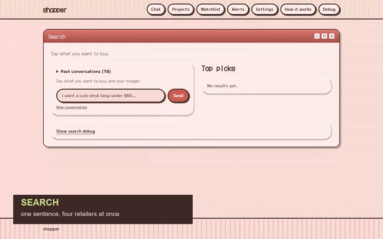

# Shopper

Describe what you want in a sentence. If something important is missing, Shopper asks one
question first. Then it searches Best Buy, Target, Amazon and Micro Center at once, researches
the best candidates on Reddit and YouTube, ranks them, and tells you which to buy and why. Track
anything and it re-checks the price every six hours and emails you when it drops.



*[Full walkthrough, 78s](docs/demo.mp4)*

Python/FastAPI + React + SQLite, Claude for the judgment calls. Runs on your own machine.
A search takes about 80 seconds, almost all of it waiting on retailers.

## Run it

```bash
cp .env.example .env          # ANTHROPIC_API_KEY is required
pip install -r requirements.txt
playwright install chromium
.venv/Scripts/uvicorn backend.main:app --reload --port 8000
cd frontend && npm install && npm run dev
```

Set your location on `/settings` so store distance counts; without one, searches run online-only.

```bash
pytest              # 362 tests, no network, no model calls, ~5s
pytest -m live      # 29 that hit the real retailers and the real API
```

## What it does

**Chat** — one sentence in, five ranked products out, each with the evidence behind its score.
If the request is missing something that matters, it asks one question before searching.

**Projects** — paste a Claude conversation, it pulls out the shopping list and prices every item
you tick.

**Watchlist** — tracked items re-priced every 6 hours, with real price history. Target hits email
immediately, everything else batches into a daily digest.

## Four things that were wrong

Every one found by measuring, not by reading the code.

**Every product said "no rating found."** Ratings were read from the product page, which is
exactly the page Best Buy blocks and Amazon throttles first. All four retailers print the rating
on their *search* page, the one that reliably loads.

**A search for an RGB mouse returned three mice without RGB.** The filter only treated stated
*numbers* as strict, so "rgb" could never disqualify anything. Then the review floor deleted the
two mice that did have RGB, because a blocked page publishes no review count and `0` was being
read as "zero reviews" rather than "we could not see."

**The four retailers ran one after another.** The trace made it obvious: 27s + 4s + 13s + 18s
summed exactly to the 63-second stage. Concurrent now, 115s to 80s.

**Two keyboards at $60.04 and $60.09 scored 1.0 and 0.0 on price.** Price is scored relative to
the result set, and the set spanned five cents.

## Retailers

Measured 2026-08-19. A blocked retailer is reported, never worked around: no stealth plugins, no
proxies, no captcha solving. "Nothing matched" is only ever said when a retailer actually
answered.

| retailer | search | product page |
| --- | --- | --- |
| Micro Center | works | works, publishes the Mfr Part# |
| Best Buy | works | Akamai-blocked |
| Target | 403s in stretches | works when search does |
| Amazon | throttles under load | first to be throttled |

Reddit 429s a fair share of searches. Every one of these is treated as a missing source, never a
failed run.

## More

- [Pipeline walkthrough](docs/pipeline.md) — every stage with its payloads, the nine tables,
  and where the 80 seconds goes
- [API.md](API.md) — the endpoint contract
- [spec.md](spec.md) — what I planned before building it, kept because the finished app disagrees
  with it in most of the interesting places

MIT.
