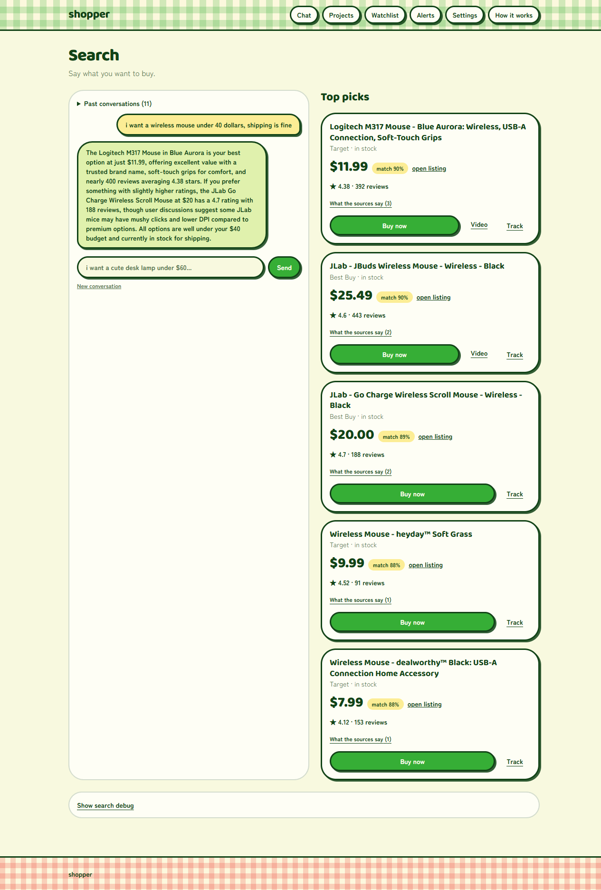

# Shopper

Describe what you want in a sentence. Shopper searches Best Buy, Target, Amazon and Micro Center,
researches the best candidates on Reddit and YouTube, ranks them, and tells you which to buy and
why. Track anything and it re-checks the price every six hours and emails you when it drops.

Personal-use app, runs on your own machine, one SQLite file. Python/FastAPI backend, React
frontend, Claude for the judgment calls.



**A search takes about 80 seconds**, almost all of it waiting on retailers. The chat shows which
retailer is answering while it works.

See [API.md](API.md) for the endpoint contract. [spec.md](spec.md) is what I planned before
building any of it — kept deliberately, because the finished app disagrees with it in most of the
interesting places.

## Running it

Requires an `ANTHROPIC_API_KEY` — the app refuses to start without one, because product filtering is
a model call with no offline substitute.

```bash
cp .env.example .env          # then fill in the keys
pip install -r requirements.txt
playwright install chromium
.venv/Scripts/uvicorn backend.main:app --reload --port 8000
```

```bash
cd frontend && npm install && npm run dev     # http://localhost:5173
cd frontend && npm run build                  # typecheck + static build into frontend/dist
```

React + TanStack Router (SPA, file-based routes under `frontend/src/routes/`) + Tailwind v4.
`src/routeTree.gen.ts` is generated by the router plugin whenever Vite runs, and is committed so
`npm run build` can typecheck before Vite starts.

The pages: `/` chat and results (with the debug panel), `/watchlist`, `/items/$id` price history,
`/alerts`, `/settings` location and email, `/how-it-works` a plain-English tour of the pipeline.
Result cards carry three controls — **Buy now** links straight out to the retailer, **Video** shows
only when that product has a YouTube review attached, **Track** starts watching it.

Vite proxies `/api` to port 8000. Restart both after editing `.env` — the backend reads keys at
import and Vite bakes `VITE_` vars in at startup. Address autocomplete on Settings needs
`VITE_GOOGLE_PLACES_API_KEY` with the Places API (New) enabled; without it the page falls back to
the browser's own location.

## Projects

Paste a Claude planning conversation — or a claude.ai share link — into `/projects` and one model
call pulls out the things you would have to buy. Tick what you want, and each one gets a real
search. Results land on a project page with Buy/Track on every pick, plus a markdown summary to
paste back into the chat that started it.

There is no Claude API for reading conversations, so there is no "log in with Claude".

**Paste is the path that works.** Share links are accepted and host-checked against claude.ai
before being fetched, but claude.ai sits behind Cloudflare, which answers our headless browser
with a bot check rather than the page (measured 2026-08-19). That is reported as a block saying
so, not as "your conversation had nothing to buy" — the challenge page is short enough that it
used to slip past the length check and reach the model, which then truthfully reported no
products in a conversation it had never seen.

A run is **5 items at a time, sequential, with no Reddit/YouTube stage** — N parallel or fully
researched pipelines multiply the request rate against retailers that already rate-limit us.
About a minute an item.

## How a search works

1. Search all four retailers, filter and score the results — one model call judges every listing
   at once (does it qualify, how well does it fit, which listings are the same product).
2. Rank them.
3. Research the **top 5 individually**: one Reddit search per product, on that product's own name,
   paced because Reddit rate-limits.
4. One model call reads that per-product discussion and also says which products it cannot
   separate. Only if the top is genuinely too close does YouTube get searched, for the top 2 only —
   a decisive search costs zero YouTube quota (each search is 100 of ~10000 daily units).
5. Re-rank on what the research found, then narrate.

While a search runs, the chat page polls `GET /api/chat/progress/{conversation_id}` and shows the
stage it is on, each retailer as its search returns, and the qualification and research counts.
That is read off the same trace object the run is already filling in, so the waiting screen and the
debug panel can never disagree.

Every run records a **debug trace**: per retailer the search url, the outcome, the page size and the
row counts; the qualification call's in/out counts and the model's reason for each rejected product;
which products got Reddit and whether YouTube was triggered; every dropped candidate with its
reason; and milliseconds per stage. It comes back on the chat results response under `debug` and the
last 5 runs are readable from `GET /api/debug/last` — memory only, gone on restart.

A retailer search ends in one of `OK`, `OK_BUT_EMPTY` (it answered, it has nothing),
`BLOCKED` (captcha/403/challenge page), `SELECTORS_RETURNED_NOTHING` (a real page loaded and the
parser found no rows in it) or `ERROR`. They are kept apart because they need different fixes, and
because "nothing matched your criteria" is only true when a retailer actually answered — when none
of them did, the reply says the search did not run instead.

`distance_score` is per retailer, not per product: Google Places finds the nearest Target, Best
Buy and Micro Center to your saved location once per location, and the score falls linearly from the door to the
edge of `radius_miles`. Amazon and any failed lookup score a neutral 0.5.

## What persists, and the jobs

Everything durable is in one SQLite file, `app.db` at the repo root: watched items, listings,
price history, alerts, conversations and projects all survive a restart. The path is **resolved
from the repo, not the working directory** — `sqlite:///./app.db` used to mean "wherever you
launched uvicorn from", so starting the server elsewhere silently created a second empty
database that looked exactly like losing everything.

Only the debug traces (last 5, `trace._recent`) and an in-flight project run are memory-only.

Items, conversations and projects can each be deleted from the UI. Deleting a conversation
deliberately leaves anything you watched from it alone — a watched product is a watchlist item
of its own by then, and clearing chat history must not silently stop tracking a price.

Three background jobs, started with the server:

| job | when | what |
| --- | --- | --- |
| `scrape` | every 6 hours from server start | re-price every watched item; a target-price hit emails immediately |
| `review_check` | daily at 03:00 local | look for better alternatives to what you watch |
| `digest` | daily at 08:00 local | one email with everything that queued up since yesterday |

A price drop or a new alternative waits for the digest; only `target_hit` mails you on the spot.
A new alternative only counts if it is **cheaper than anything already stored** for that item,
capped at 3 per item per run — otherwise a rescan across four retailers reports every URL it
has not seen before, which sent 21 "new alternative" notices for one USB hub in a single email.

## Tests

```bash
pytest              # 243 tests, free, no network, ~4s
pytest -m live      # 29 tests that hit the real retailers and the real Claude API
```

The default run is pure logic against the saved captures in `tests/fixtures/` — one real scrape per
retailer, kept permanently as frozen test input, with `<script>`/`<style>` stripped so the repo
carries markup rather than two megabytes of minified vendor JS. Nothing mocks the model and nothing replays a
scrape at runtime: a test either exercises pure logic on a literal payload, or it makes the real
calls and is marked `live`.

## Things that were wrong, and how they were found

Every one of these was found by measuring, not by reading the code.

**Every product said "no rating found."** Ratings were read from the product page — which is
exactly the page Best Buy blocks with Akamai and Amazon throttles first. All four retailers print
the rating on their **search** page, the one that reliably loads. It had been thrown away and
re-fetched from the page we could not get.

**A search for an RGB mouse returned three mice without RGB.** Two bugs compounding. The filter
only treated stated *quantities* as strict, so "rgb" could never disqualify anything. Then the
review floor deleted the two mice that did have RGB, because Best Buy publishes no review count
and `0` was being read as "zero reviews" rather than "we could not see." A count nobody published
now cannot fall below a threshold.

**The four retailers ran one after another.** The trace made it obvious: 27s + 4s + 13s + 18s
summed exactly to the 63-second stage. They are four different hosts, so nothing was being
rate-limited by the wait. Running them concurrently took a search from 115s to 80s.

**Two keyboards at $60.04 and $60.09 scored 1.0 and 0.0 on price.** Price is scored relative to
the result set, and the set spanned five cents. A spread under 5% of the cheapest candidate now
scores everything equally.

**One email contained 21 "new alternative" alerts about a single USB hub.** A rescan across four
retailers finds ~20 URLs it has not stored before, and each became an alert. An alternative now
has to be cheaper than anything already found, capped at three per item.

**An import said "no products were found in that conversation"** about a conversation that was a
list of PC peripherals. Cloudflare had served a bot check instead of the page; the challenge was
370 characters and the "is this a real transcript" threshold was 200, so it sailed through to the
model, which truthfully reported no products in it. The worst kind of error message: it blamed the
user for something never read.

**Every search hit `NotImplementedError` inside the app while working fine from a script.**
`uvicorn --reload` selects a Windows event loop that cannot spawn subprocesses, and Playwright
launches Chromium as one.

## On scraping

No stealth plugins, no proxies, no user-agent rotation, no retry escalation, no captcha solving.
When a retailer blocks us it is reported — with which one and why — and the run continues on
whatever answered. "Nothing matched your criteria" is only ever said when a retailer actually
answered; when none did, the reply says the search did not run.

## Retailers

The app is live-only — every search hits the real sites, there is no fixture mode.

Current state (2026-08-19):

| retailer | search | product page | notes |
| --- | --- | --- | --- |
| Micro Center | works | works | server-rendered, no bot wall, publishes the Mfr Part# |
| Best Buy | works | Akamai-blocked | rating comes off the search tile instead |
| Target | 403s in stretches | works when search does | plain JSON, no browser |
| Amazon | works, throttles under load | first thing to be throttled | rating comes off the search tile |

Reddit 429s a fair share of searches. The pipeline treats every one of these as a missing
source, never a failed run.

**All four print the star rating on their search page**, which is the page most likely to load,
so a rating no longer depends on reaching a product page.
